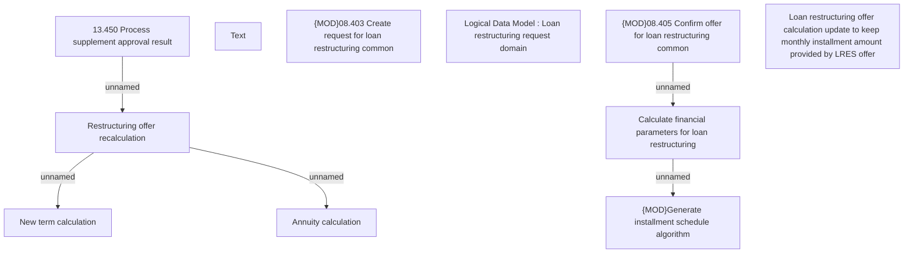

# CBL-9759 (CLM-3088) Loan restructuring offer calculation update

- **Diagram Type**: Custom
- **Package**: HomerSelect/BSL/Requirements Model/Finished/CLM/CBL-9759 (CLM-3059) Create API for Loan restructuring
- **Diagram ID**: 144803
- **Elements**: 11
- **Connectors**: 5

