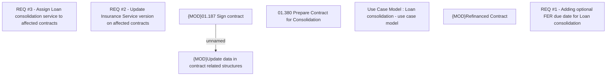

# CBL-9811 (CLM-3001)[COVID19] Loan consolidation for ID

- **Diagram Type**: Custom
- **Package**: HomerSelect/BSL/Requirements Model/Finished/CLM/CBL-9811 (CLM-3001)[COVID19] Loan consolidation for ID
- **Diagram ID**: 144780
- **Elements**: 8
- **Connectors**: 1

