# CLM 813 (CBL-1249) Hide client's phone number

- **Diagram Type**: Custom
- **Package**: HomerSelect/BSL/Requirements Model/Finished/CLM/CLM 813 (CBL-1249) Hide client's phone number
- **Diagram ID**: 105758
- **Elements**: 12
- **Connectors**: 10

```mermaid
graph TD
    MOD_06_030_Show_Client_Data["{MOD}06.030 Show Client Data"]
    element_E9917828_1FE2_48a3_819C_EF827AF59F8A["$element://{E9917828-1FE2-48a3-819C-EF827AF59F8A}"]
    MOD_01_210_Show_contract_detail["{MOD}01.210 Show contract detail"]
    element_89EC1A68_9268_475d_86EB_99C120542C02["$element://{89EC1A68-9268-475d-86EB-99C120542C02}"]
    User_Interface_Model_Contract_detail["User Interface Model : Contract detail"]
    Default_Client_detail_Default["Default : Client detail - Default"]
    Tab_Document_printouts_Tab_Document_Printouts["Tab-Document printouts : Tab-Document Printouts"]
    Tab_Client_Tab_Client["Tab-Client : Tab-Client"]
    ADD_01_210_Show_client_s_phone_Tab_Client_on_Contract_detail["{ADD} 01.210 Show client´s phone (Tab Client on Contract detail)"]
    ADD_01_210_Show_Document_Printouts_Tab_on_Contract_detail["{ADD} 01.210 Show Document Printouts Tab on Contract detail"]
    n_06_030_Show_client_s_phone_Client_detail["06.030 Show client´s phone (Client detail)"]
    REQ_1_Mask_phone_number_of_client_in_BSL_on_the_Client_detai["REQ#1 - Mask phone number of client in BSL - on the Client detail screen, Contract detail - client's info screen and Document printouts tab"]
    MOD_01_210_Show_contract_detail -->|unnamed| ADD_01_210_Show_Document_Printouts_Tab_on_Contract_detail
    MOD_01_210_Show_contract_detail -->|unnamed| ADD_01_210_Show_client_s_phone_Tab_Client_on_Contract_detail
    Tab_Client_Tab_Client -->|unnamed| REQ_1_Mask_phone_number_of_client_in_BSL_on_the_Client_detai
    Tab_Document_printouts_Tab_Document_Printouts -->|unnamed| REQ_1_Mask_phone_number_of_client_in_BSL_on_the_Client_detai
    Default_Client_detail_Default -->|unnamed| REQ_1_Mask_phone_number_of_client_in_BSL_on_the_Client_detai
    element_89EC1A68_9268_475d_86EB_99C120542C02 -->|unnamed| REQ_1_Mask_phone_number_of_client_in_BSL_on_the_Client_detai
    element_E9917828_1FE2_48a3_819C_EF827AF59F8A -->|unnamed| REQ_1_Mask_phone_number_of_client_in_BSL_on_the_Client_detai
    User_Interface_Model_Contract_detail -->|unnamed| Tab_Client_Tab_Client
    User_Interface_Model_Contract_detail -->|unnamed| Tab_Document_printouts_Tab_Document_Printouts
    MOD_06_030_Show_Client_Data -->|unnamed| n_06_030_Show_client_s_phone_Client_detail
```

