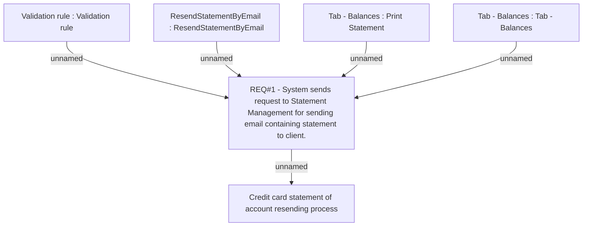

# CLM-1008 (CBL-2072) Credit card statement of account resending process

```mermaid
graph TD
    Validation_rule_Validation_rule["Validation rule : Validation rule"]
    ResendStatementByEmail_ResendStatementByEmail["ResendStatementByEmail : ResendStatementByEmail"]
    Tab_Balances_Print_Statement["Tab - Balances : Print Statement"]
    Tab_Balances_Tab_Balances["Tab - Balances : Tab - Balances"]
    REQ_1_System_sends_request_to_Statement_Management_for_sendi["REQ#1 - System sends request to Statement Management for sending email containing statement to client."]
    Credit_card_statement_of_account_resending_process["Credit card statement of account resending process"]
    REQ_1_System_sends_request_to_Statement_Management_for_sendi -->|unnamed| Credit_card_statement_of_account_resending_process
    Validation_rule_Validation_rule -->|unnamed| REQ_1_System_sends_request_to_Statement_Management_for_sendi
    ResendStatementByEmail_ResendStatementByEmail -->|unnamed| REQ_1_System_sends_request_to_Statement_Management_for_sendi
    Tab_Balances_Print_Statement -->|unnamed| REQ_1_System_sends_request_to_Statement_Management_for_sendi
    Tab_Balances_Tab_Balances -->|unnamed| REQ_1_System_sends_request_to_Statement_Management_for_sendi
```
