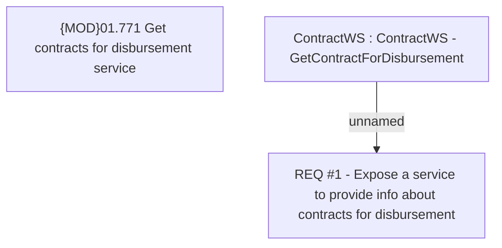

# CLM-102 (CBL-49) Online information about contract for money disbursement

- **Diagram Type**: Custom
- **Package**: HomerSelect/BSL/Requirements Model/Finished/CLM/CLM-102 (CBL-49) Online information about contract for money disbursement
- **Diagram ID**: 105757
- **Elements**: 3
- **Connectors**: 1

