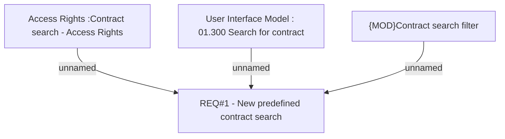

# CLM-103 (CBL-54) Disbursement of cash loans

```mermaid
graph TD
    Access_Rights_Contract_search_Access_Rights["Access Rights :Contract search - Access Rights"]
    REQ_1_New_predefined_contract_search["REQ#1 - New predefined contract search"]
    User_Interface_Model_01_300_Search_for_contract["User Interface Model : 01.300 Search for contract"]
    MOD_Contract_search_filter["{MOD}Contract search filter"]
    Access_Rights_Contract_search_Access_Rights -->|unnamed| REQ_1_New_predefined_contract_search
    User_Interface_Model_01_300_Search_for_contract -->|unnamed| REQ_1_New_predefined_contract_search
    MOD_Contract_search_filter -->|unnamed| REQ_1_New_predefined_contract_search
```
