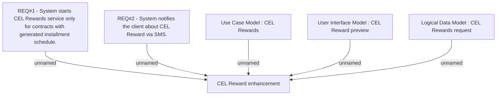

# CLM-1042 (CBL-2283) CEL Reward enhancement

- **Diagram Type**: Custom
- **Package**: HomerSelect/BSL/Requirements Model/Finished/CLM/CLM-1042 (CBL-2283) CEL Reward enhancement
- **Diagram ID**: 103491
- **Elements**: 6
- **Connectors**: 5

