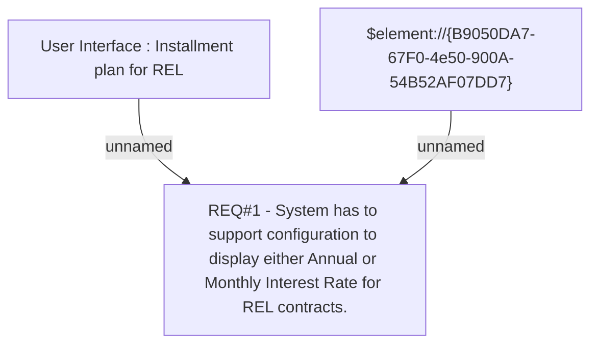

# CLM-106 (CBL-20) Monthly interest rate

```mermaid
graph TD
    element_B9050DA7_67F0_4e50_900A_54B52AF07DD7["$element://{B9050DA7-67F0-4e50-900A-54B52AF07DD7}"]
    User_Interface_Installment_plan_for_REL["User Interface : Installment plan for REL"]
    REQ_1_System_has_to_support_configuration_to_display_either_["REQ#1 - System has to support configuration to display either Annual or Monthly Interest Rate for REL contracts."]
    User_Interface_Installment_plan_for_REL -->|unnamed| REQ_1_System_has_to_support_configuration_to_display_either_
    element_B9050DA7_67F0_4e50_900A_54B52AF07DD7 -->|unnamed| REQ_1_System_has_to_support_configuration_to_display_either_
```
