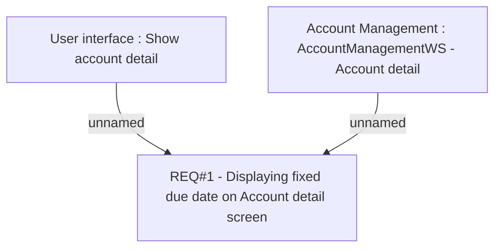

# CLM-107 (CBL-19) Fixed due date

- **Diagram Type**: Custom
- **Package**: HomerSelect/BSL/Requirements Model/Finished/CLM/CLM-107 (CBL-19) Fixed due date
- **Diagram ID**: 103243
- **Elements**: 3
- **Connectors**: 2

