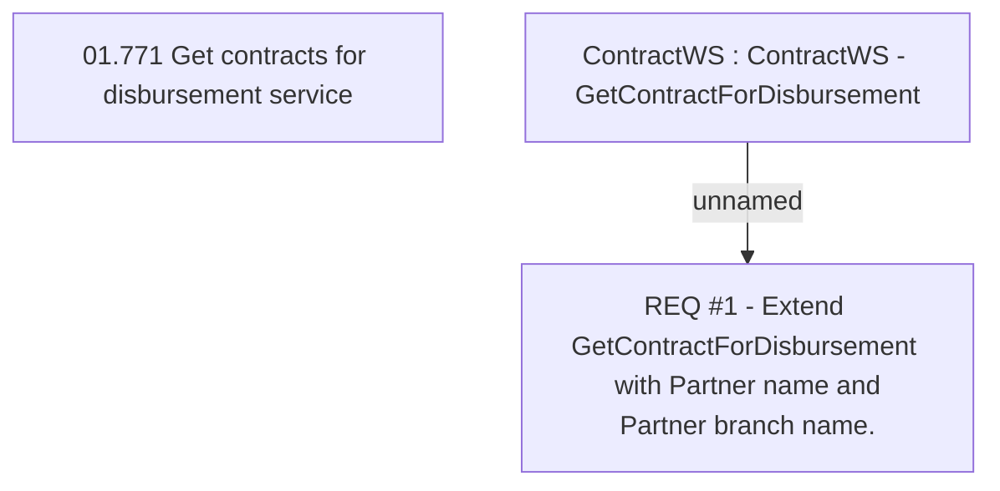

# CLM-1147 (CBL-2581) E-wallet - Update Disbursement service

- **Diagram Type**: Custom
- **Package**: HomerSelect/BSL/Requirements Model/Finished/CLM/CLM-1147 (CBL-2581) E-wallet - Update Disbursement service
- **Diagram ID**: 105762
- **Elements**: 3
- **Connectors**: 1

