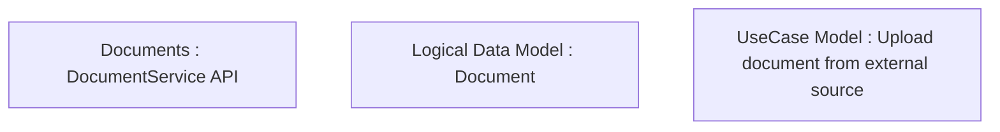

# CLM-226 (CBL-193) Service for upload contract document from 3rd party application

- **Diagram Type**: Custom
- **Package**: HomerSelect/BSL/Requirements Model/Finished/CLM/CLM-226 (CBL-193) Service for upload contract document from 3rd party application
- **Diagram ID**: 103148
- **Elements**: 3
- **Connectors**: 0

