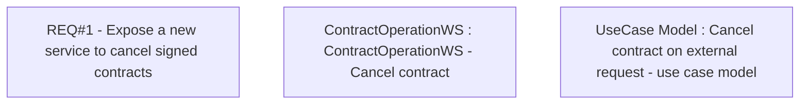

# CLM-227 (CBL-241) OASys Phase 2d - Enhance ability of Cancel Application API

```mermaid
graph TD
    REQ_1_Expose_a_new_service_to_cancel_signed_contracts["REQ#1 - Expose a new service to cancel signed contracts"]
    ContractOperationWS_ContractOperationWS_Cancel_contract["ContractOperationWS : ContractOperationWS - Cancel contract"]
    UseCase_Model_Cancel_contract_on_external_request_use_case_m["UseCase Model : Cancel contract on external request - use case model"]
```
