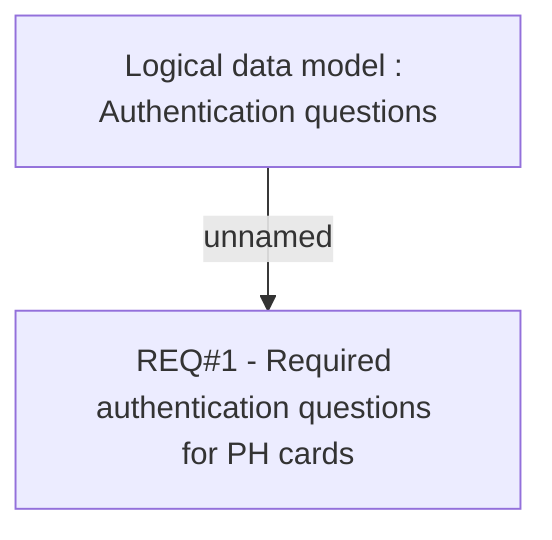

# PRS-428 CONF PH CARDS - Security and authentication questions

- **Diagram Type**: Custom
- **Package**: HomerSelect/BSL/Requirements Model/Finished/CLM/CLM-246 (CBL-199) CONF PH CARDS - Security and authentication questions
- **Diagram ID**: 103244
- **Elements**: 2
- **Connectors**: 1

