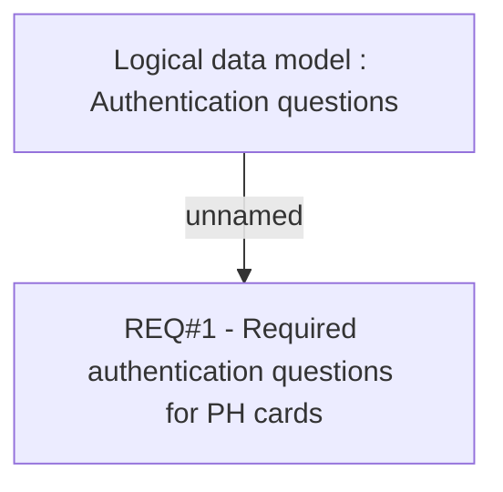

# PRS-428 CONF PH CARDS - Security and authentication questions

```mermaid
graph TD
    Logical_data_model_Authentication_questions["Logical data model : Authentication questions"]
    REQ_1_Required_authentication_questions_for_PH_cards["REQ#1 - Required authentication questions for PH cards"]
    Logical_data_model_Authentication_questions -->|unnamed| REQ_1_Required_authentication_questions_for_PH_cards
```
