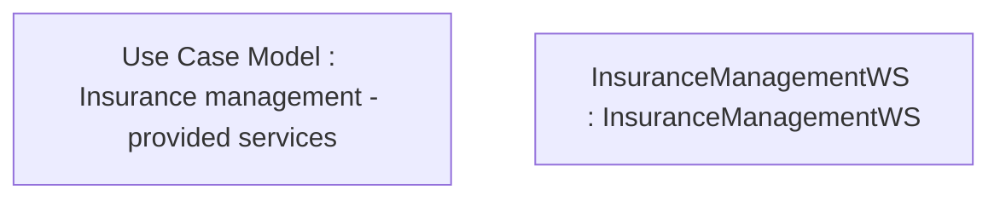

# CLM-301 (CBL-36) 2-step online API

- **Diagram Type**: Custom
- **Package**: HomerSelect/BSL/Requirements Model/Finished/CLM/CLM-301 (CBL-36) 2-step online API
- **Diagram ID**: 86401
- **Elements**: 2
- **Connectors**: 0

