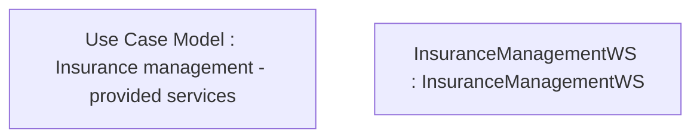

# CLM-301 (CBL-36) 2-step online API

```mermaid
graph TD
    Use_Case_Model_Insurance_management_provided_services["Use Case Model : Insurance management - provided services"]
    InsuranceManagementWS_InsuranceManagementWS["InsuranceManagementWS : InsuranceManagementWS"]
```
