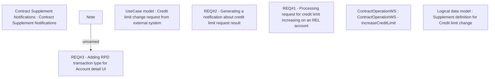

# CLM-303 (CBL-145) Online sales via cards with instalment plan II.phase

```mermaid
graph TD
    Contract_Supplement_Notifications_Contract_Supplement_Notifi["Contract Supplement Notifications : Contract Supplement Notifications"]
    REQ_3_Adding_RPD_transaction_type_for_Account_detail_UI["REQ#3 - Adding RPD transaction type for Account detail UI"]
    el_1271044["Note"]
    UseCase_model_Credit_limit_change_request_from_external_syst["UseCase model : Credit limit change request from external system"]
    REQ_2_Generating_a_notification_about_credit_limit_request_r["REQ#2 - Generating a notification about credit limit request result"]
    REQ_1_Processing_request_for_credit_limit_increasing_on_an_R["REQ#1 - Processing request for credit limit increasing on an REL account"]
    ContractOperationWS_ContractOperationWS_IncreaseCreditLimit["ContractOperationWS : ContractOperationWS - IncreaseCreditLimit"]
    Logical_data_model_Supplement_definition_for_Credit_limit_ch["Logical data model : Supplement definition for Credit limit change"]
    el_1271044 -->|unnamed| REQ_3_Adding_RPD_transaction_type_for_Account_detail_UI
```
