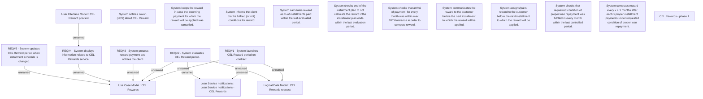

# CLM-304 (CBL-109) CEL Rewards

```mermaid
graph TD
    REQ_5_System_updates_CEL_Reward_period_when_installment_sche["REQ#5 - System updates CEL Reward period when installment schedule is changed."]
    Logical_Data_Model_CEL_Rewards_request["Logical Data Model : CEL Rewards request"]
    REQ_4_System_displays_information_related_to_CEL_Rewards_ser["REQ#4 - System displays information related to CEL Rewards service."]
    REQ_3_System_process_reward_payment_and_notifies_the_client["REQ#3 - System process reward payment and notifies the client."]
    REQ_2_System_evaluates_CEL_Reward_period["REQ#2 - System evaluates CEL Reward period."]
    REQ_1_System_launches_CEL_Reward_period_on_contract["REQ#1 - System launches CEL Reward period on contract."]
    User_Interface_Model_CEL_Reward_preview["User Interface Model : CEL Reward preview"]
    Use_Case_Model_CEL_Rewards["Use Case Model : CEL Rewards "]
    System_notifies_Loxon_LCS_about_CEL_Reward["System notifies Loxon (LCS) about CEL Reward."]
    Loan_Service_notifications_Loan_Service_notifications_CEL_Re["Loan Service notifications : Loan Service notifications - CEL Rewards"]
    System_keeps_the_reward_in_case_the_incoming_payment_for_whi["System keeps the reward in case the incoming payment for which the reward will be applied was cancelled."]
    System_informs_the_client_that_he_fulfiled_or_not_conditions["System informs the client that he fulfiled (or not) conditions for reward."]
    System_calculates_reward_as_of_installments_paid_within_the_["System calculates reward as % of installments paid within the last evaluated period."]
    System_checks_end_of_the_installment_plan_to_not_calculate_t["System checks end of the installment plan to not calculate the reward if the installment plan ends within the last evaluation period."]
    System_checks_that_arrival_of_payment_for_every_month_was_wi["System checks that arrival of payment  for every month was within max DPD tolerance in order to compute reward."]
    System_communicates_the_reward_to_the_customer_before_the_ne["System communicates the reward to the customer before the next installment to which the reward will be applied."]
    System_assigns_pairs_reward_to_the_customer_before_the_next_["System assigns/pairs reward to the customer before the next installment to which the reward will be applied."]
    System_checks_that_requested_condition_of_proper_loan_repaym["System checks that requested condition of proper loan repayment was fulfilled in every month within the last controlled period."]
    System_computes_reward_every_x_1_months_after_each_x_proper_["System computes reward every x + 1 months after each x proper installment payments under requested condition of proper loan repayment."]
    CEL_Rewards_phase_1["CEL Rewards - phase 1"]
    User_Interface_Model_CEL_Reward_preview -->|unnamed| REQ_4_System_displays_information_related_to_CEL_Rewards_ser
    REQ_1_System_launches_CEL_Reward_period_on_contract -->|unnamed| Loan_Service_notifications_Loan_Service_notifications_CEL_Re
    REQ_1_System_launches_CEL_Reward_period_on_contract -->|unnamed| Use_Case_Model_CEL_Rewards
    REQ_1_System_launches_CEL_Reward_period_on_contract -->|unnamed| Logical_Data_Model_CEL_Rewards_request
    REQ_2_System_evaluates_CEL_Reward_period -->|unnamed| Loan_Service_notifications_Loan_Service_notifications_CEL_Re
    REQ_2_System_evaluates_CEL_Reward_period -->|unnamed| Use_Case_Model_CEL_Rewards
    REQ_2_System_evaluates_CEL_Reward_period -->|unnamed| Logical_Data_Model_CEL_Rewards_request
    REQ_3_System_process_reward_payment_and_notifies_the_client -->|unnamed| Use_Case_Model_CEL_Rewards
    REQ_4_System_displays_information_related_to_CEL_Rewards_ser -->|unnamed| Use_Case_Model_CEL_Rewards
    REQ_5_System_updates_CEL_Reward_period_when_installment_sche -->|unnamed| Use_Case_Model_CEL_Rewards
```
