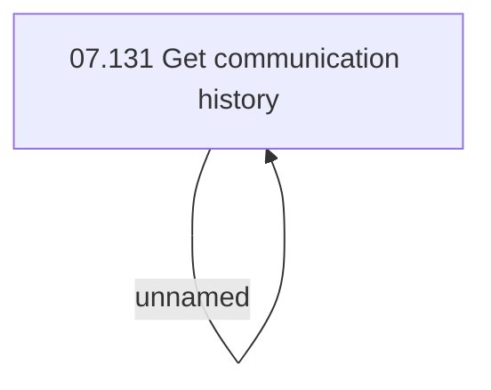

# Access rights

- **Diagram Type**: Custom
- **Package**: HomerSelect/BSL/Requirements Model/Finished/CLM/CLM-306 (CBL-149) CRM SAS Campaign management - changes in data input and logic/Access rights
- **Diagram ID**: 103641
- **Elements**: 2
- **Connectors**: 1

