# Client detail

- **Diagram Type**: Custom
- **Package**: HomerSelect/BSL/Requirements Model/Finished/CLM/CLM-306 (CBL-149) CRM SAS Campaign management - changes in data input and logic/User interface
- **Diagram ID**: 103266
- **Elements**: 18
- **Connectors**: 0

```mermaid
graph TD
    Preferred_language["Preferred language"]
    Age["Age"]
    Statement_channel["Statement channel "]
    Total_unpaid_debt["Total unpaid debt"]
    Total_overdue_debt["Total overdue debt"]
    MOD_Identification_documents["{MOD}Identification documents"]
    MOD_Primary_mobile["{MOD}Primary mobile"]
    National_identification_number["National identification number"]
    MOD_Primary_e_mail["{MOD}Primary e-mail"]
    MOD_Phone["{MOD}Phone"]
    Permanent_address["Permanent address"]
    MOD_Gender["{MOD}Gender"]
    MOD_Father_full_name["{MOD}Father full name"]
    Contact_address["Contact address"]
    Client_full_name["Client full name"]
    CUID["CUID"]
    MOD_Birth_date["{MOD}Birth date"]
    Client_detail_KZ["Client detail - KZ"]
```

