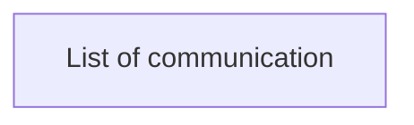

# List of communication

- **Diagram Type**: Custom
- **Package**: HomerSelect/BSL/Requirements Model/Finished/CLM/CLM-306 (CBL-149) CRM SAS Campaign management - changes in data input and logic/User interface
- **Diagram ID**: 103267
- **Elements**: 1
- **Connectors**: 0

