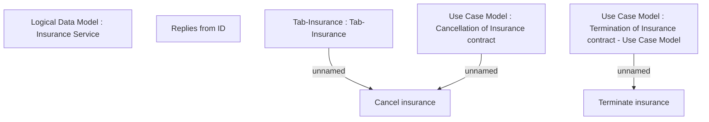

# CLM-307 (CBL-83) Insurance Cancelation for CEL Product Portfolio

```mermaid
graph TD
    Logical_Data_Model_Insurance_Service["Logical Data Model : Insurance Service"]
    Replies_from_ID["Replies from ID"]
    Terminate_insurance["Terminate insurance"]
    Use_Case_Model_Cancellation_of_Insurance_contract["Use Case Model : Cancellation of Insurance contract"]
    Use_Case_Model_Termination_of_Insurance_contract_Use_Case_Mo["Use Case Model : Termination of Insurance contract - Use Case Model"]
    Tab_Insurance_Tab_Insurance["Tab-Insurance : Tab-Insurance"]
    Cancel_insurance["Cancel insurance"]
    Tab_Insurance_Tab_Insurance -->|unnamed| Cancel_insurance
    Use_Case_Model_Termination_of_Insurance_contract_Use_Case_Mo -->|unnamed| Terminate_insurance
    Use_Case_Model_Cancellation_of_Insurance_contract -->|unnamed| Cancel_insurance
```
