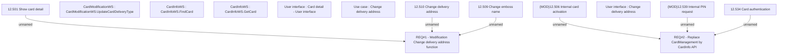

# CLM-323 (CBL-68) Card delivery address selection

```mermaid
graph TD
    n_12_509_Change_emboss_name["12.509 Change emboss name"]
    CardModificationWS_CardModificationWS_UpdateCardDeliveryType["CardModificationWS : CardModificationWS.UpdateCardDeliveryType"]
    CardInfoWS_CardInfoWS_FindCard["CardInfoWS : CardInfoWS.FindCard"]
    CardInfoWS_CardInfoWS_GetCard["CardInfoWS : CardInfoWS.GetCard"]
    User_interface_Card_detail_User_interface["User interface : Card detail - User interface"]
    Use_case_Change_delivery_address["Use case : Change delivery address"]
    n_12_534_Card_authentication["12.534 Card authentication"]
    MOD_12_539_Internal_PIN_request["{MOD}12.539 Internal PIN request"]
    MOD_12_506_Internal_card_activation["{MOD}12.506 Internal card activation"]
    REQ_1_Modification_Change_delivery_address_function["REQ#1 - Modification Change delivery address function"]
    REQ_2_Replace_CardManagement_by_CardInfo_API["REQ#2 - Replace CardManagement by CardInfo API"]
    User_interface_Change_delivery_address["User interface : Change delivery address"]
    n_12_510_Change_delivery_address["12.510 Change delivery address"]
    n_12_501_Show_card_detail["12.501 Show card detail"]
    n_12_501_Show_card_detail -->|unnamed| REQ_1_Modification_Change_delivery_address_function
    n_12_510_Change_delivery_address -->|unnamed| REQ_1_Modification_Change_delivery_address_function
    MOD_12_506_Internal_card_activation -->|unnamed| REQ_2_Replace_CardManagement_by_CardInfo_API
    MOD_12_539_Internal_PIN_request -->|unnamed| REQ_2_Replace_CardManagement_by_CardInfo_API
    n_12_534_Card_authentication -->|unnamed| REQ_2_Replace_CardManagement_by_CardInfo_API
    n_12_509_Change_emboss_name -->|unnamed| REQ_1_Modification_Change_delivery_address_function
```
