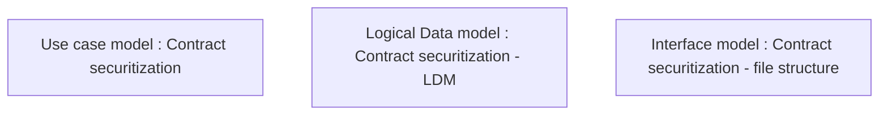

# CLM-327 (CBL-382) Securitization - account for premium

- **Diagram Type**: Custom
- **Package**: HomerSelect/BSL/Requirements Model/Finished/CLM/CLM-327 (CBL-382) Securitization - account for premium
- **Diagram ID**: 103195
- **Elements**: 3
- **Connectors**: 0

