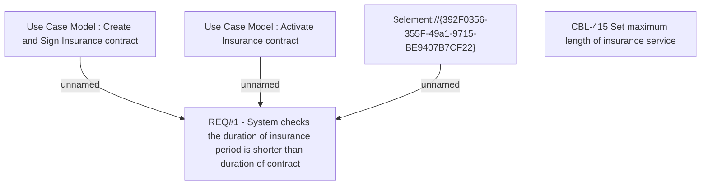

# CLM-339 (CBL-415) Set maximum length of insurance services

- **Diagram Type**: Custom
- **Package**: HomerSelect/BSL/Requirements Model/Finished/CLM/CLM-339 (CBL-415) Set maximum length of insurance services
- **Diagram ID**: 103240
- **Elements**: 5
- **Connectors**: 3

