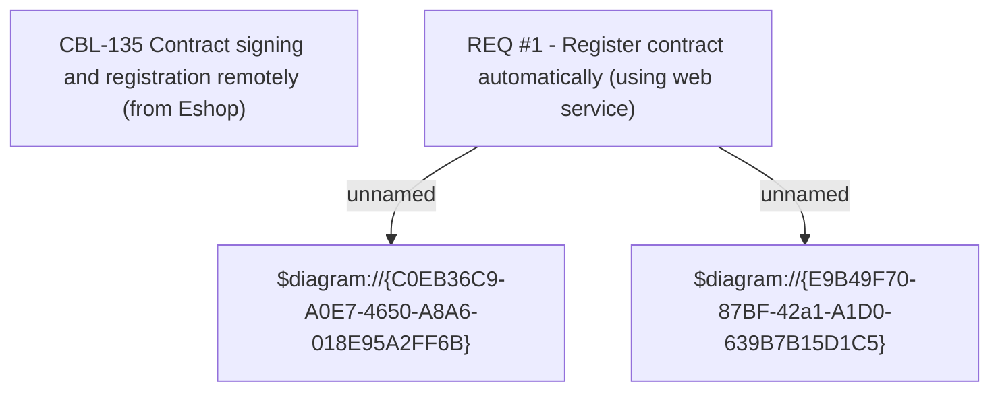

# CLM-340 (CBL-135) Contract signing and registration remotely (from Eshop)

- **Diagram Type**: Custom
- **Package**: HomerSelect/BSL/Requirements Model/Finished/CLM/CLM-340 (CBL-135)
- **Diagram ID**: 103388
- **Elements**: 4
- **Connectors**: 2

