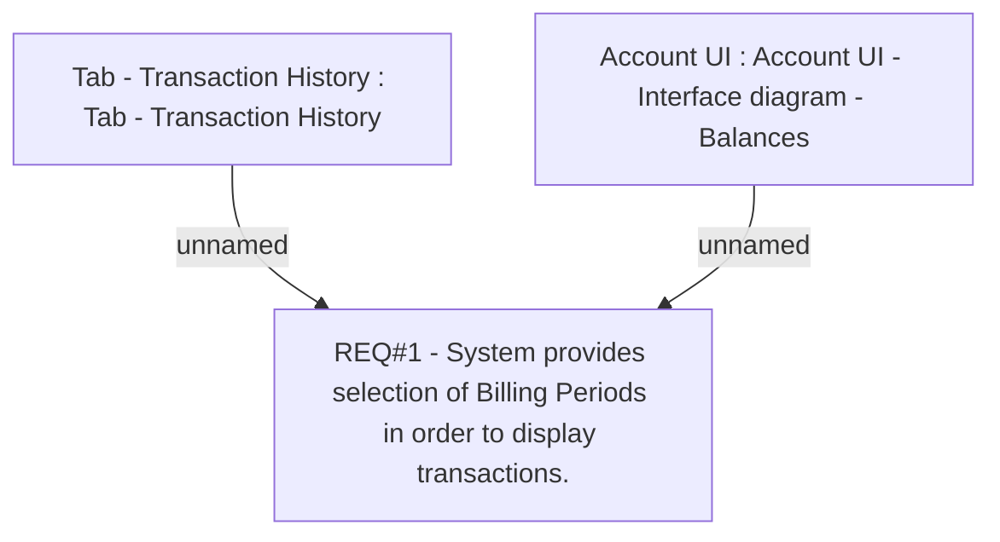

# CLM-393 (CBL-298) BSL Transaction History Period Selection

```mermaid
graph TD
    Account_UI_Account_UI_Interface_diagram_Balances["Account UI : Account UI - Interface diagram - Balances"]
    Tab_Transaction_History_Tab_Transaction_History["Tab - Transaction History : Tab - Transaction History"]
    REQ_1_System_provides_selection_of_Billing_Periods_in_order_["REQ#1 - System provides selection of Billing Periods in order to display transactions."]
    Tab_Transaction_History_Tab_Transaction_History -->|unnamed| REQ_1_System_provides_selection_of_Billing_Periods_in_order_
    Account_UI_Account_UI_Interface_diagram_Balances -->|unnamed| REQ_1_System_provides_selection_of_Billing_Periods_in_order_
```
