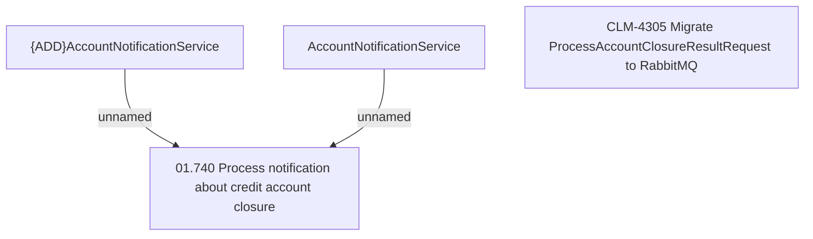

# CLM-4305 (CBL-14055) Migrate ProcessAccountClosureResultRequest to RabbitMQ

```mermaid
graph TD
    AccountNotificationService["AccountNotificationService"]
    ADD_AccountNotificationService["{ADD}AccountNotificationService"]
    n_01_740_Process_notification_about_credit_account_closure["01.740 Process notification about credit account closure "]
    CLM_4305_Migrate_ProcessAccountClosureResultRequest_to_Rabbi["CLM-4305 Migrate ProcessAccountClosureResultRequest to RabbitMQ"]
    ADD_AccountNotificationService -->|unnamed| n_01_740_Process_notification_about_credit_account_closure
    AccountNotificationService -->|unnamed| n_01_740_Process_notification_about_credit_account_closure
```
