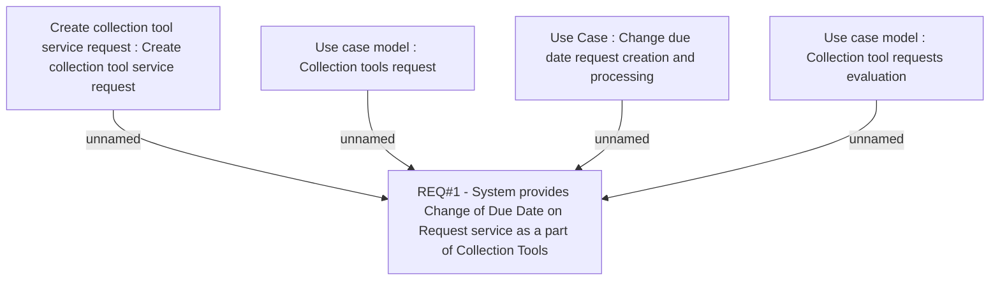

# CLM-438 (CBL-308) CHDDR as a Part of Collection Tools

- **Diagram Type**: Custom
- **Package**: HomerSelect/BSL/Requirements Model/Finished/CLM/CLM-438 (CBL-308) CHDDR as a Part of Collection Tools
- **Diagram ID**: 103335
- **Elements**: 5
- **Connectors**: 4

