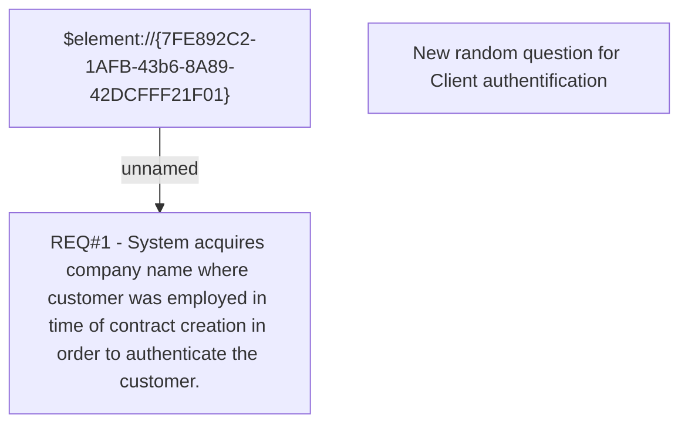

# CLM-448 (CBL-626) Add random question for current employer (VN)

- **Diagram Type**: Custom
- **Package**: HomerSelect/BSL/Requirements Model/Finished/CLM/CLM-448 (CBL-626) Add random question for current employer (VN)
- **Diagram ID**: 103247
- **Elements**: 3
- **Connectors**: 1

