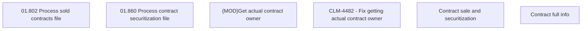

# CLM-4482 - Fix getting actual contract owner

- **Diagram Type**: Custom
- **Package**: HomerSelect/BSL/Requirements Model/Finished/CLM/CLM-4482 - Fix getting actual contract owner
- **Diagram ID**: 144886
- **Elements**: 6
- **Connectors**: 0

