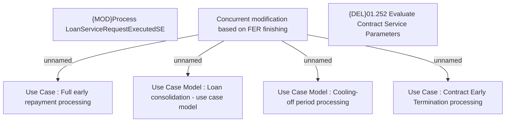

# CLM-4771 - Concurrent modification based on FER finishing

```mermaid
graph TD
    MOD_Process_LoanServiceRequestExecutedSE["{MOD}Process LoanServiceRequestExecutedSE"]
    Use_Case_Full_early_repayment_processing["Use Case : Full early repayment processing"]
    Use_Case_Model_Loan_consolidation_use_case_model["Use Case Model : Loan consolidation - use case model"]
    Use_Case_Model_Cooling_off_period_processing["Use Case Model : Cooling-off period processing"]
    Use_Case_Contract_Early_Termination_processing["Use Case : Contract Early Termination processing"]
    Concurrent_modification_based_on_FER_finishing["Concurrent modification based on FER finishing"]
    DEL_01_252_Evaluate_Contract_Service_Parameters["{DEL}01.252 Evaluate Contract Service Parameters"]
    Concurrent_modification_based_on_FER_finishing -->|unnamed| Use_Case_Full_early_repayment_processing
    Concurrent_modification_based_on_FER_finishing -->|unnamed| Use_Case_Model_Loan_consolidation_use_case_model
    Concurrent_modification_based_on_FER_finishing -->|unnamed| Use_Case_Model_Cooling_off_period_processing
    Concurrent_modification_based_on_FER_finishing -->|unnamed| Use_Case_Contract_Early_Termination_processing
```
