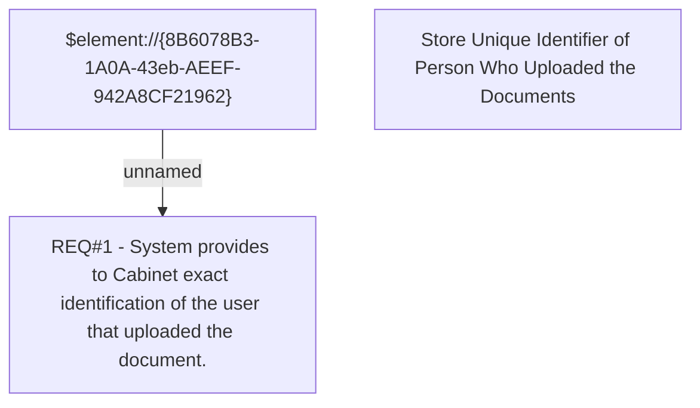

# CLM-481 (CBL-397) Store Unique Identifier of Person Who Uploaded the Documents

- **Diagram Type**: Custom
- **Package**: HomerSelect/BSL/Requirements Model/Finished/CLM/CLM-481 (CBL-397) Store Unique Identifier of Person Who Uploaded the Documents
- **Diagram ID**: 103248
- **Elements**: 3
- **Connectors**: 1

