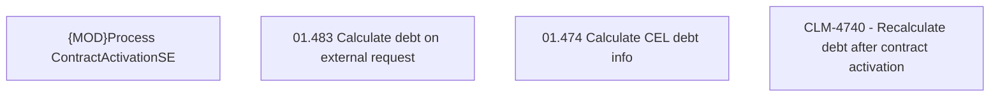

# CLM-4740 - Recalculate debt after contract activation

```mermaid
graph TD
    MOD_Process_ContractActivationSE["{MOD}Process ContractActivationSE"]
    n_01_483_Calculate_debt_on_external_request["01.483 Calculate debt on external request"]
    n_01_474_Calculate_CEL_debt_info["01.474 Calculate CEL debt info"]
    CLM_4740_Recalculate_debt_after_contract_activation["CLM-4740 - Recalculate debt after contract activation"]
```
