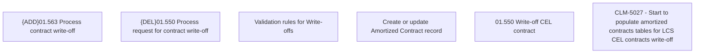

# CLM-5027 - Start to populate amortized contracts tables for LCS CEL contracts write-off

- **Diagram Type**: Custom
- **Package**: HomerSelect/BSL/Requirements Model/Finished/CLM/CLM-5027 - Start to populate amortized contracts tables for LCS CEL contracts write-off
- **Diagram ID**: 147407
- **Elements**: 6
- **Connectors**: 0

