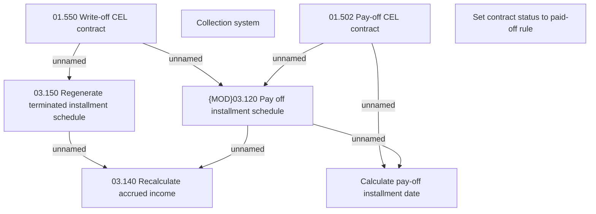

# CLM-5043 (CBL-18002) - Pay-off refactoring

```mermaid
graph TD
    n_03_150_Regenerate_terminated_installment_schedule["03.150 Regenerate terminated installment schedule"]
    n_01_550_Write_off_CEL_contract["01.550 Write-off CEL contract"]
    Collection_system["Collection system"]
    n_03_140_Recalculate_accrued_income["03.140 Recalculate accrued income"]
    MOD_03_120_Pay_off_installment_schedule["{MOD}03.120 Pay off installment schedule"]
    Calculate_pay_off_installment_date["Calculate pay-off installment date"]
    n_01_502_Pay_off_CEL_contract["01.502 Pay-off CEL contract"]
    Set_contract_status_to_paid_off_rule["Set contract status to paid-off rule"]
    n_01_550_Write_off_CEL_contract -->|unnamed| MOD_03_120_Pay_off_installment_schedule
    n_01_550_Write_off_CEL_contract -->|unnamed| n_03_150_Regenerate_terminated_installment_schedule
    n_01_502_Pay_off_CEL_contract -->|unnamed| Calculate_pay_off_installment_date
    n_01_502_Pay_off_CEL_contract -->|unnamed| MOD_03_120_Pay_off_installment_schedule
    n_03_150_Regenerate_terminated_installment_schedule -->|unnamed| n_03_140_Recalculate_accrued_income
    MOD_03_120_Pay_off_installment_schedule -->|unnamed| n_03_140_Recalculate_accrued_income
    MOD_03_120_Pay_off_installment_schedule -->|unnamed| Calculate_pay_off_installment_date
```
