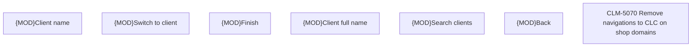

# CLM-5070 Remove navigations to CLC on shop domains

- **Diagram Type**: Custom
- **Package**: HomerSelect/BSL/Requirements Model/Finished/CLM/CLM-5070 Remove navigations to CLC on shop domains
- **Diagram ID**: 147825
- **Elements**: 8
- **Connectors**: 0

