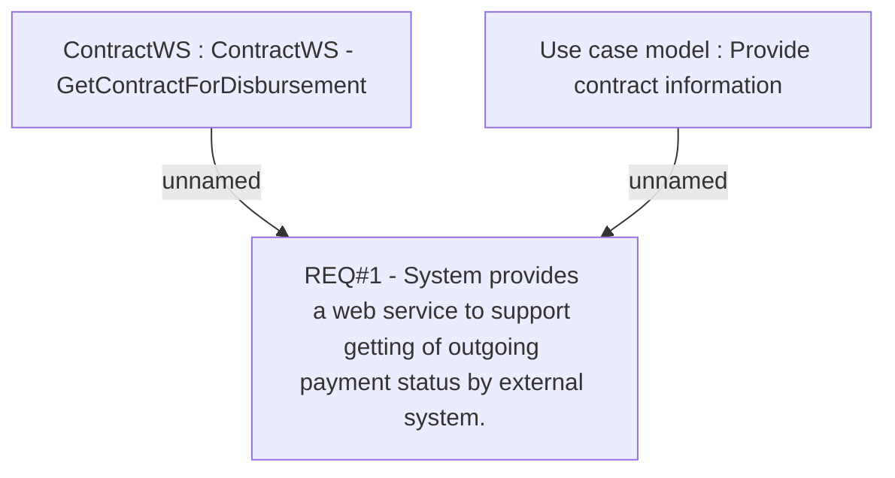

# CLM-531 (CBL-445) Extension of ContractWS

- **Diagram Type**: Custom
- **Package**: HomerSelect/BSL/Requirements Model/Finished/CLM/CLM-531 (CBL-445) Extension of ContractWS
- **Diagram ID**: 103251
- **Elements**: 3
- **Connectors**: 2

