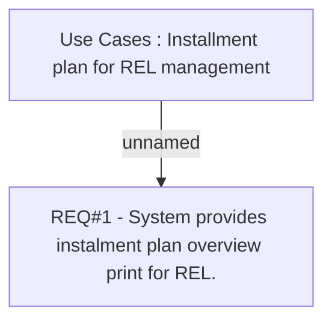

# CLM-545 (CBL-609) Instalment Plan overview print

- **Diagram Type**: Custom
- **Package**: HomerSelect/BSL/Requirements Model/Finished/CLM/CLM-545 (CBL-609) Instalment Plan overview print
- **Diagram ID**: 103260
- **Elements**: 2
- **Connectors**: 1

