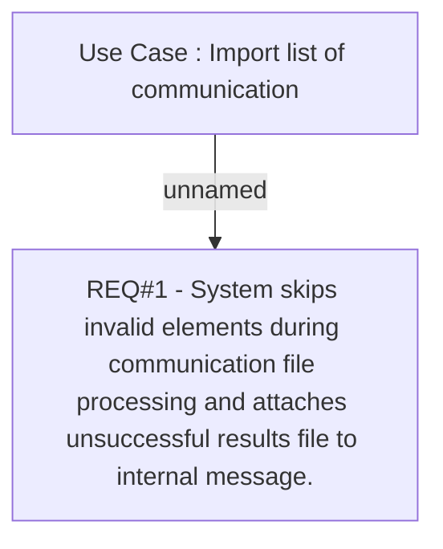

# CLM-551 (CBL-790) Improvement of Communication list import file processing

- **Diagram Type**: Custom
- **Package**: HomerSelect/BSL/Requirements Model/Finished/CLM/CLM-551 (CBL-790) Improvement of Communication list import file processing
- **Diagram ID**: 103353
- **Elements**: 2
- **Connectors**: 1

