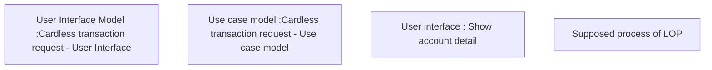

# CLM-611 (CBL-86) LOP (Loan On Phone)

```mermaid
graph TD
    User_Interface_Model_Cardless_transaction_request_User_Inter["User Interface Model :Cardless transaction request - User Interface"]
    Use_case_model_Cardless_transaction_request_Use_case_model["Use case model :Cardless transaction request - Use case model"]
    User_interface_Show_account_detail["User interface : Show account detail"]
    Supposed_process_of_LOP["Supposed process of LOP"]
```
