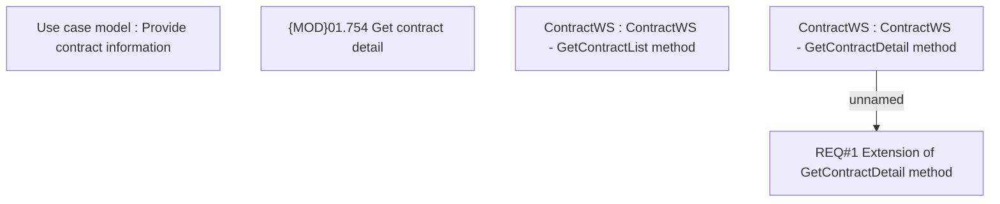

# CLM-622 (CBL-219) Credit Card MMIL definition

- **Diagram Type**: Custom
- **Package**: HomerSelect/BSL/Requirements Model/Finished/CLM/CLM-622 (CBL-219) Credit Card MMIL definition
- **Diagram ID**: 103277
- **Elements**: 5
- **Connectors**: 1

