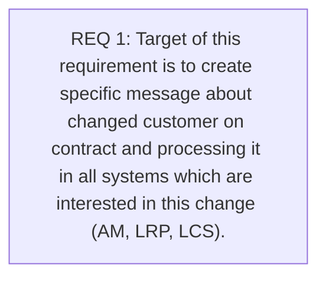

# CLM-625 (CBL-73) CUID change on contract

- **Diagram Type**: Custom
- **Package**: HomerSelect/BSL/Requirements Model/Finished/CLM/CLM-625 (CBL-73) CUID change on contract
- **Diagram ID**: 103464
- **Elements**: 1
- **Connectors**: 0

