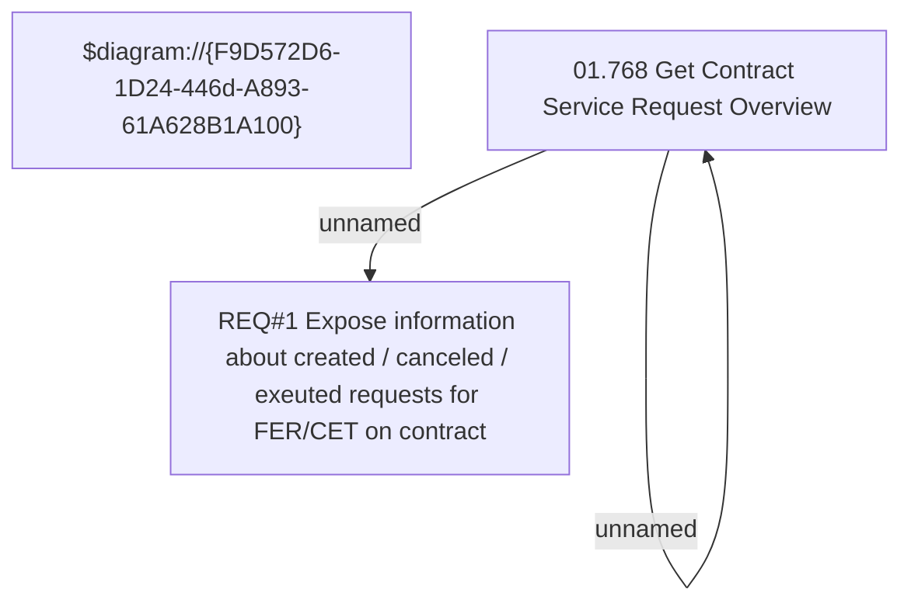

# CLM-626 (CBL-399) Adding info about active FER/CET request

```mermaid
graph TD
    diagram_F9D572D6_1D24_446d_A893_61A628B1A100["$diagram://{F9D572D6-1D24-446d-A893-61A628B1A100}"]
    n_01_768_Get_Contract_Service_Request_Overview["01.768 Get Contract Service Request Overview"]
    n_01_768_Get_Contract_Service_Request_Overview["01.768 Get Contract Service Request Overview"]
    REQ_1_Expose_information_about_created_canceled_exeuted_requ["REQ#1 Expose information about created / canceled / exeuted requests for FER/CET on contract"]
    n_01_768_Get_Contract_Service_Request_Overview -->|unnamed| REQ_1_Expose_information_about_created_canceled_exeuted_requ
    n_01_768_Get_Contract_Service_Request_Overview -->|unnamed| n_01_768_Get_Contract_Service_Request_Overview
```
