# CLM-649 (CBL-837) Authentication Questions with Possible Empty Answer

- **Diagram Type**: Custom
- **Package**: HomerSelect/BSL/Requirements Model/Finished/CLM/CLM-649 (CBL-837) Authentication Questions with Possible Empty Answer
- **Diagram ID**: 103348
- **Elements**: 11
- **Connectors**: 8

```mermaid
graph TD
    Logical_data_model_Business_event_Logical_data_model["Logical data model : Business event - Logical data model"]
    Business_events_Business_events_provided_interface["Business events : Business events - provided interface"]
    Logical_data_model_Card_operations_enums_LDM["Logical data model : Card operations enums - LDM"]
    REQ_5_System_displays_business_event_when_CARD_PIN_GENERATIO["REQ#5 - System displays business event when CARD PIN GENERATION FAILED reason is UNSUCCESSFUL CHANGE THROUGH MAP"]
    element_1FA7B226_FA60_4d79_8B8A_700F038796E9["$element://{1FA7B226-FA60-4d79-8B8A-700F038796E9}"]
    User_interface_Client_authentication["User interface : Client authentication"]
    REQ_4_System_displays_only_authentication_questions_with_ava["REQ#4 - System displays only authentication questions with available (non-empty) answers."]
    el_1271621["Note"]
    REQ_3_System_generates_authentication_question_asking_for_cu["REQ#3 - System generates authentication question asking for customer's email address."]
    REQ_2_System_generates_authentication_question_asking_for_cu["REQ#2 - System generates authentication question asking for customer's employment address."]
    REQ_1_System_generates_authentication_question_asking_for_4_["REQ#1 - System generates authentication question asking for 4 last digits of customer's card if customer prviously recieved credit card plastic."]
    el_1271621 -->|unnamed| REQ_2_System_generates_authentication_question_asking_for_cu
    el_1271621 -->|unnamed| REQ_3_System_generates_authentication_question_asking_for_cu
    el_1271621 -->|unnamed| REQ_1_System_generates_authentication_question_asking_for_4_
    User_interface_Client_authentication -->|unnamed| REQ_4_System_displays_only_authentication_questions_with_ava
    element_1FA7B226_FA60_4d79_8B8A_700F038796E9 -->|unnamed| REQ_4_System_displays_only_authentication_questions_with_ava
    Logical_data_model_Card_operations_enums_LDM -->|unnamed| REQ_5_System_displays_business_event_when_CARD_PIN_GENERATIO
    Business_events_Business_events_provided_interface -->|unnamed| REQ_5_System_displays_business_event_when_CARD_PIN_GENERATIO
    Logical_data_model_Business_event_Logical_data_model -->|unnamed| REQ_5_System_displays_business_event_when_CARD_PIN_GENERATIO
```

