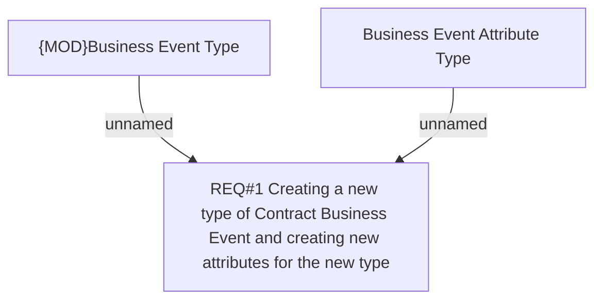

# CLM-6575 (CBL-26045) Additional Requirements for handling DPOS with Down payment

- **Diagram Type**: Custom
- **Package**: HomerSelect/BSL/Requirements Model/Finished/CLM/CLM-6575 (CBL-26045) Additional Requirements for handling DPOS with Down payment
- **Diagram ID**: 161018
- **Elements**: 3
- **Connectors**: 2

