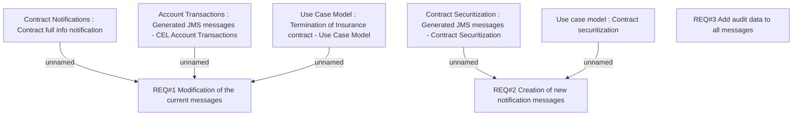

# CLM-663 (CBL-703) BSL support of BOOK NG JMS Interface

```mermaid
graph TD
    Use_Case_Model_Termination_of_Insurance_contract_Use_Case_Mo["Use Case Model : Termination of Insurance contract - Use Case Model"]
    Use_case_model_Contract_securitization["Use case model : Contract securitization"]
    Contract_Securitization_Generated_JMS_messages_Contract_Secu["Contract Securitization : Generated JMS messages - Contract Securitization"]
    Account_Transactions_Generated_JMS_messages_CEL_Account_Tran["Account Transactions : Generated JMS messages - CEL Account Transactions"]
    Contract_Notifications_Contract_full_info_notification["Contract Notifications : Contract full info notification"]
    REQ_3_Add_audit_data_to_all_messages["REQ#3 Add audit data to all messages"]
    REQ_2_Creation_of_new_notification_messages["REQ#2 Creation of new notification messages"]
    REQ_1_Modification_of_the_current_messages["REQ#1 Modification of the current messages"]
    Contract_Notifications_Contract_full_info_notification -->|unnamed| REQ_1_Modification_of_the_current_messages
    Account_Transactions_Generated_JMS_messages_CEL_Account_Tran -->|unnamed| REQ_1_Modification_of_the_current_messages
    Contract_Securitization_Generated_JMS_messages_Contract_Secu -->|unnamed| REQ_2_Creation_of_new_notification_messages
    Use_case_model_Contract_securitization -->|unnamed| REQ_2_Creation_of_new_notification_messages
    Use_Case_Model_Termination_of_Insurance_contract_Use_Case_Mo -->|unnamed| REQ_1_Modification_of_the_current_messages
```
