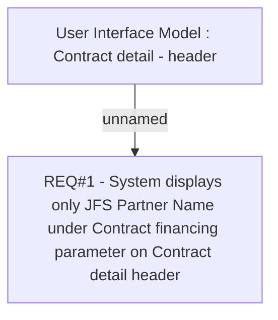

# CLM-683 (CBL-1017) Hide JFS Partner Share and JFS Partner Agreement from BSL GUI

```mermaid
graph TD
    User_Interface_Model_Contract_detail_header["User Interface Model : Contract detail - header"]
    REQ_1_System_displays_only_JFS_Partner_Name_under_Contract_f["REQ#1 - System displays only JFS Partner Name under Contract financing parameter on Contract detail header"]
    User_Interface_Model_Contract_detail_header -->|unnamed| REQ_1_System_displays_only_JFS_Partner_Name_under_Contract_f
```
