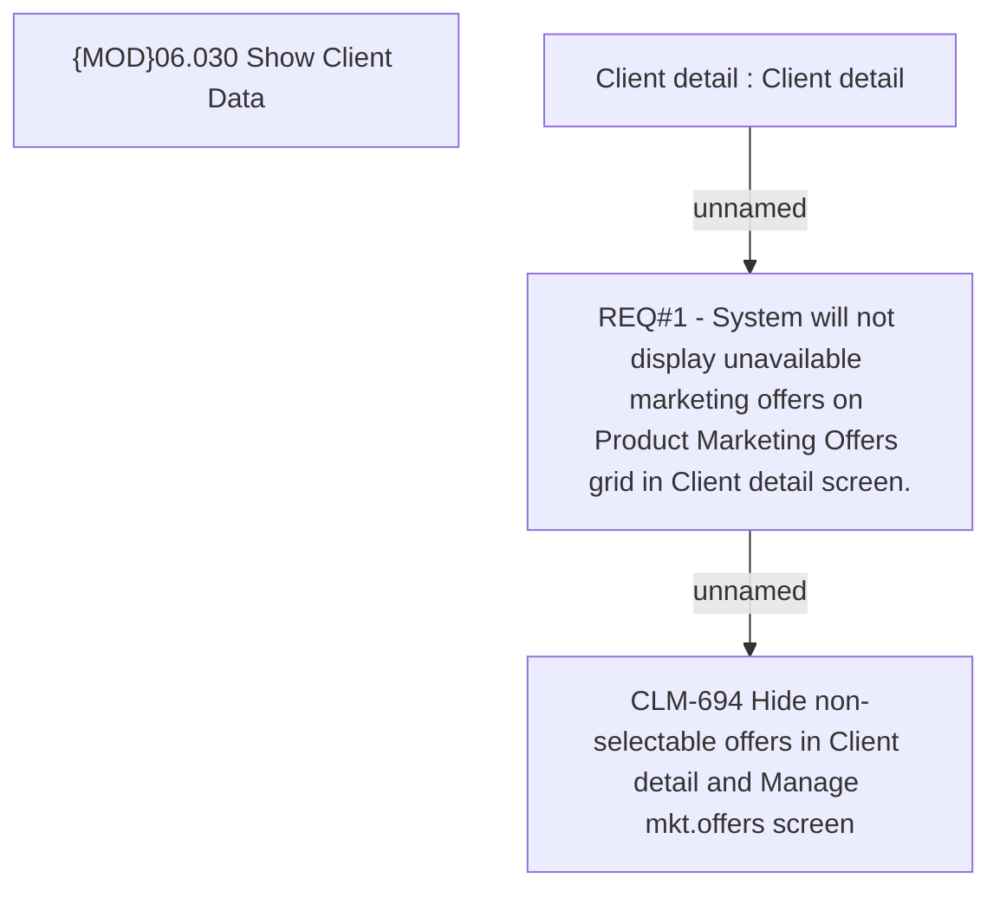

# CLM-694 (CBL-1019) Hide non-selectable offers in Client detail and Manage market offers screen

- **Diagram Type**: Custom
- **Package**: HomerSelect/BSL/Requirements Model/Finished/CLM/CLM-694 (CBL-1019) Hide non-selectable offers in Client detail and Manage market offers screen
- **Diagram ID**: 103387
- **Elements**: 4
- **Connectors**: 2

