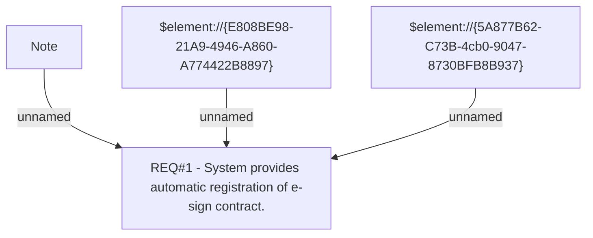

# CLM-717 (CBL-1181) Automate registration activation of e-sign contracts

```mermaid
graph TD
    element_5A877B62_C73B_4cb0_9047_8730BFB8B937["$element://{5A877B62-C73B-4cb0-9047-8730BFB8B937}"]
    element_E808BE98_21A9_4946_A860_A774422B8897["$element://{E808BE98-21A9-4946-A860-A774422B8897}"]
    el_1271560["Note"]
    REQ_1_System_provides_automatic_registration_of_e_sign_contr["REQ#1 - System provides automatic registration of e-sign contract."]
    el_1271560 -->|unnamed| REQ_1_System_provides_automatic_registration_of_e_sign_contr
    element_E808BE98_21A9_4946_A860_A774422B8897 -->|unnamed| REQ_1_System_provides_automatic_registration_of_e_sign_contr
    element_5A877B62_C73B_4cb0_9047_8730BFB8B937 -->|unnamed| REQ_1_System_provides_automatic_registration_of_e_sign_contr
```
